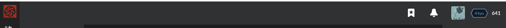

# CodeWarProjects

This repository I am using to post my completed Katas in https://www.codewars.com/users/scodek
  
### About CodeWars
"Codewars is a community of developers, who are called Code Warriors (or just warriors), that train on improving their development skills. Think of it like a coding dojo - where developers train with each other and help each other get better through practice." - from [CodeWar wiki](https://github.com/Codewars/codewars.com/wiki/About-Codewars)

The website therefore supports programming in various languages such as, JavaScript, Java, C, C++, Python, C#,CoffeeSript, Groovy, Kotlin, Ruby, Scala and what NOT !!!!!

I mainly practiced here JavaScript and till date ranked upto 4 Kyu

### Ranking System
